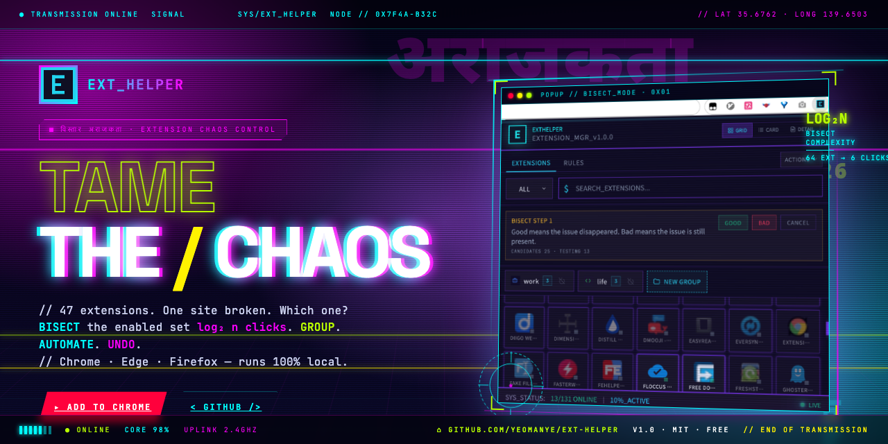
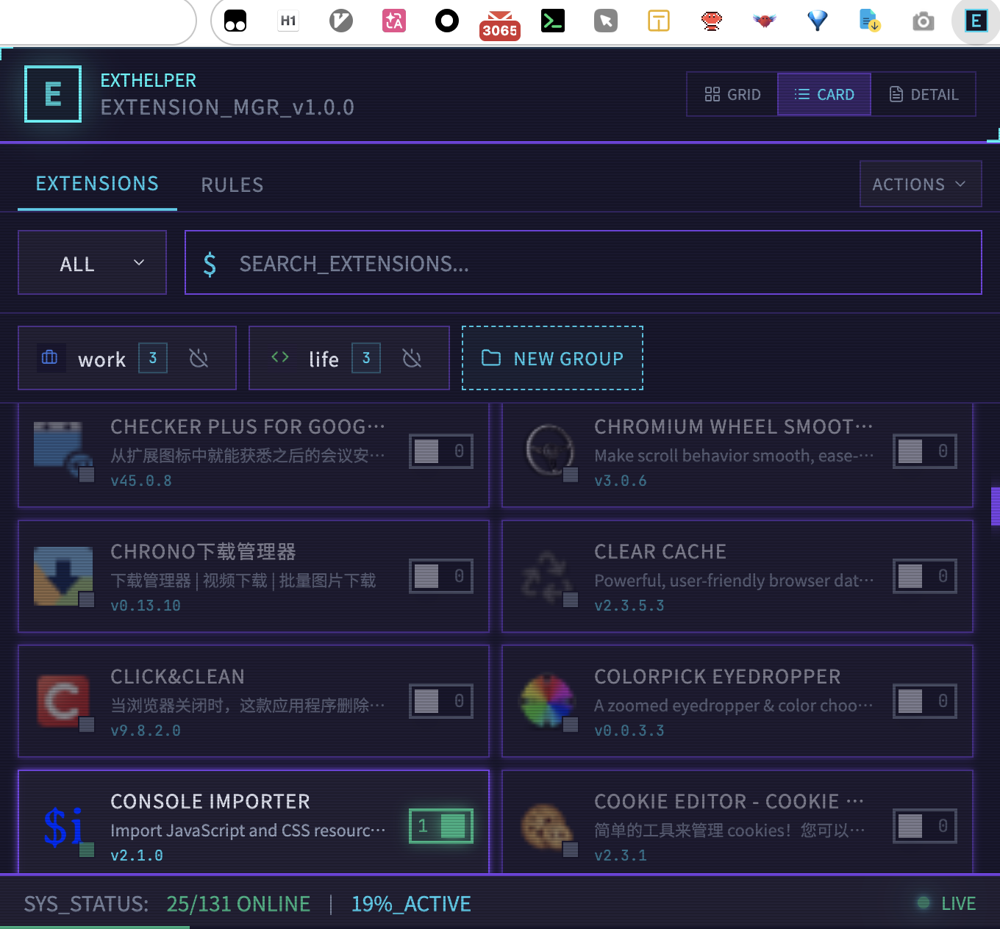
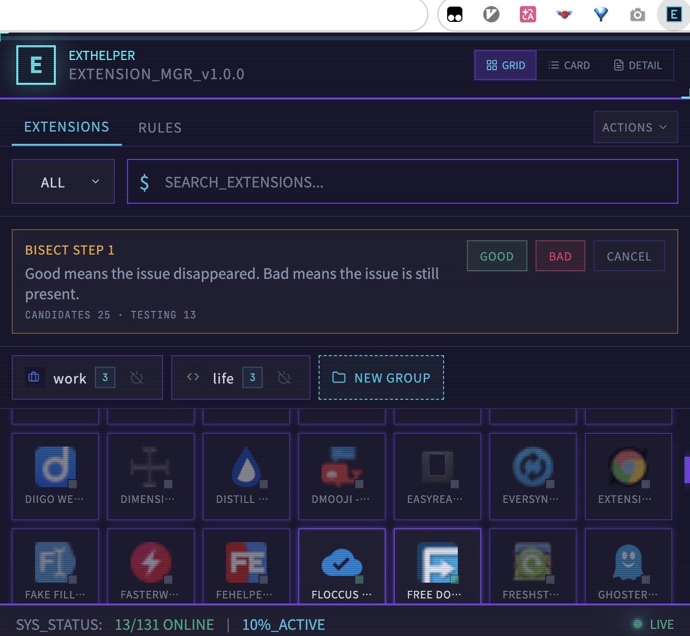
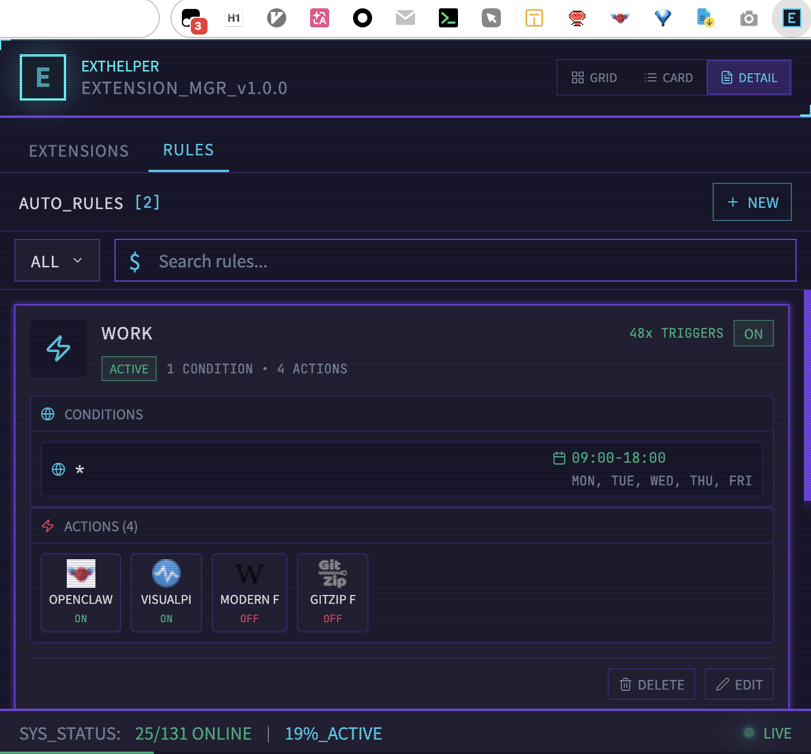

# Ext Helper



A browser extension manager for Chrome, Firefox, and Edge. Organize extensions into groups, automate enable/disable with rules, debug conflicts with binary-search bisect, and undo/redo changes instantly.

[Website](https://yeomanye.github.io/ext-helper/) · [Report an issue](https://github.com/YeomanYe/ext-helper/issues) · [Donate via PayPal](https://www.paypal.com/paypalme/yeomanye)

## Screenshots

| Card View | Bisect Debugger | Auto Rules |
|---|---|---|
|  |  |  |
| Color-coded groups, at-a-glance status | Binary search finds the culprit in log₂(n) steps | Domain + schedule conditions toggle extensions automatically |

## Features

- **Enable / disable** any installed extension from a unified popup
- **Groups** — color-coded collections with drag-and-drop and bulk toggle
- **Automation rules** — conditions on domain (exact / contains / wildcard / regex) and schedule (days + time range) that enable or disable extensions or whole groups
- **Bisect debugger** — binary-search through enabled extensions to isolate one that breaks a site
- **Snapshot undo / redo** — every mutation is reversible
- **Optimistic UI** with rollback on failure
- **Cross-browser** — Chrome, Edge, Firefox (built on Plasmo)
- **Punk-themed** design system with light / dark modes

## Install

[**Install from the Chrome Web Store →**](https://chromewebstore.google.com/detail/ext-helper/bnoomkhaemojkbmdmniifkijjaiiomfl)

Edge Add-ons and Firefox Add-ons coming soon. You can also load from source — see [Development](#development).

## Development

Requires Node 20+ and pnpm 9+.

```bash
pnpm install

pnpm dev          # Plasmo dev — loads as a real browser extension
pnpm dev:web      # Vite web preview with mock data on :4173
pnpm dev:website  # Marketing site (website/)
pnpm dev:all      # All three in parallel

pnpm build            # Extension production build
pnpm build:website    # Marketing site production build

pnpm test          # Vitest watch
pnpm test -- --run # Single run
pnpm lint          # ESLint
pnpm format        # Prettier
```

See [`CLAUDE.md`](CLAUDE.md) for a deeper tour of the architecture, and `docs/` for PRD, architecture, and module docs.

## Roadmap

See [`TODO.md`](TODO.md).

- [ ] Extension usage log — track enable/disable/install/uninstall history and usage stats
- [ ] Cloud sync — store groups, rules, and preferences in the cloud with multi-device sync

## Support

If Ext Helper saves you time, a tip goes a long way toward keeping it maintained.

[**Donate via PayPal →**](https://www.paypal.com/paypalme/yeomanye)

## License

MIT
