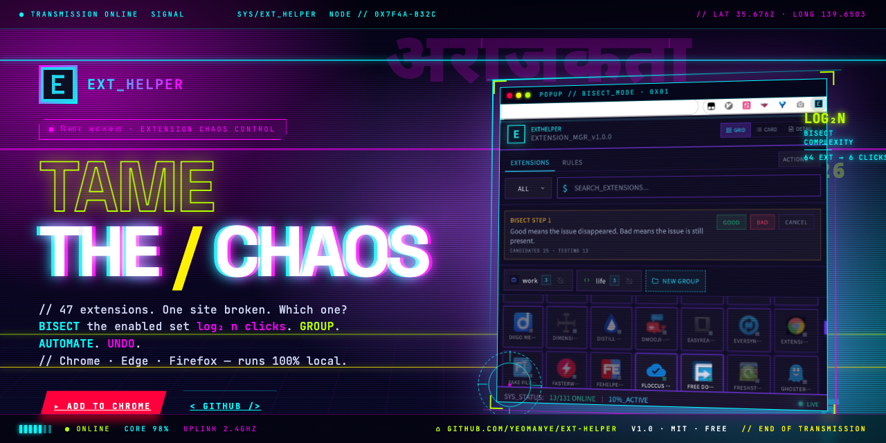
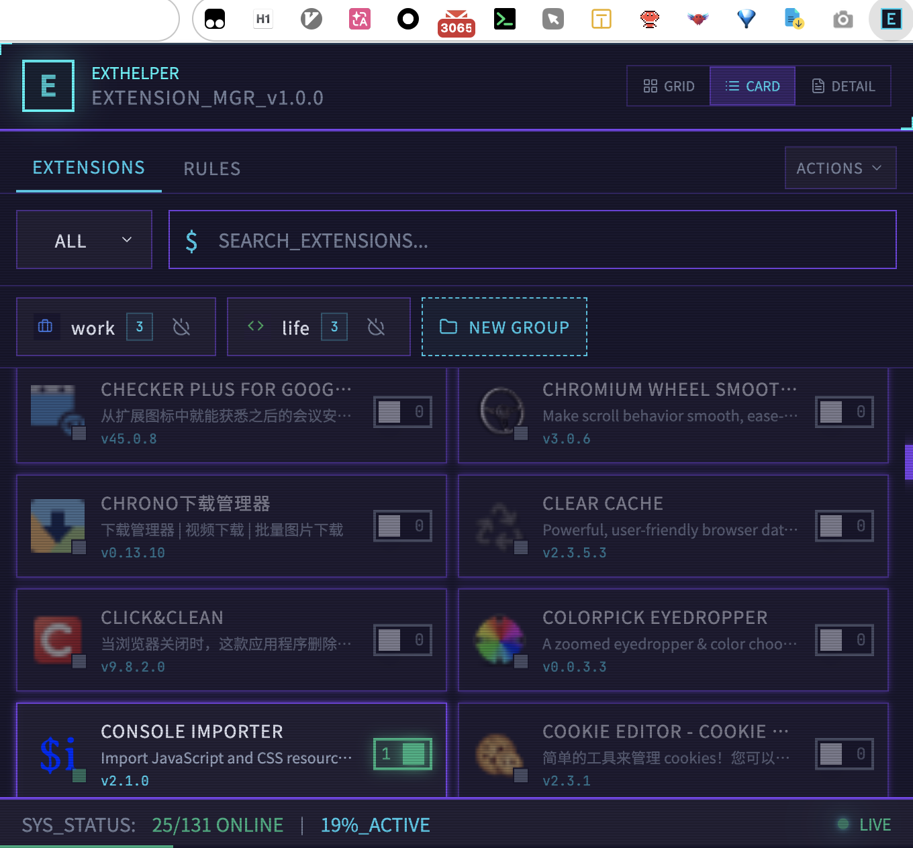
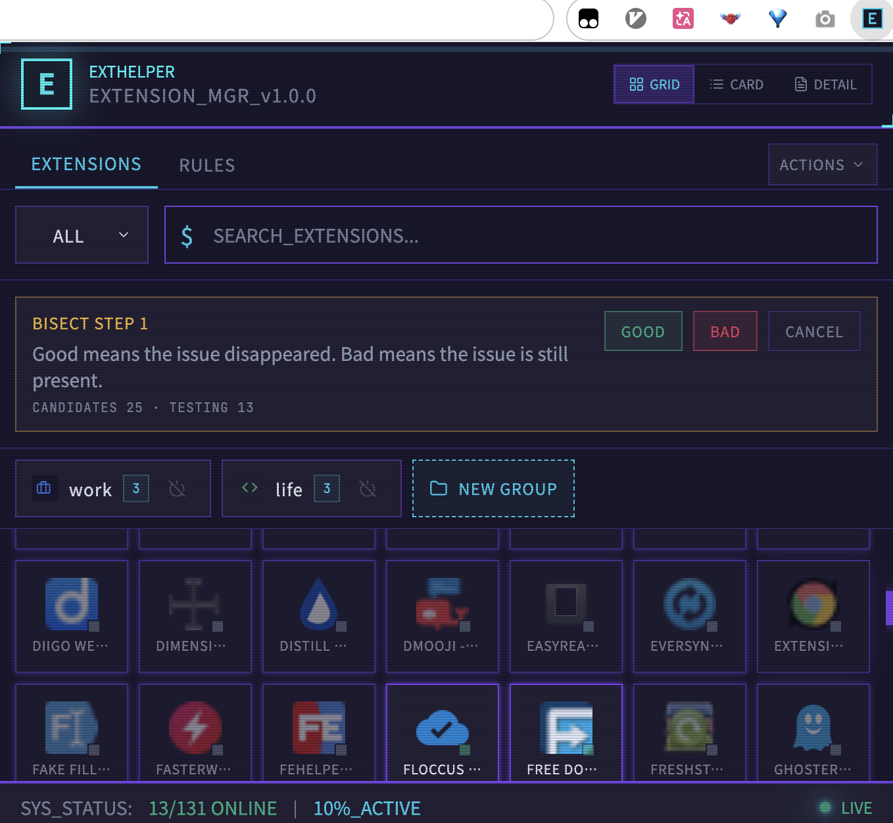
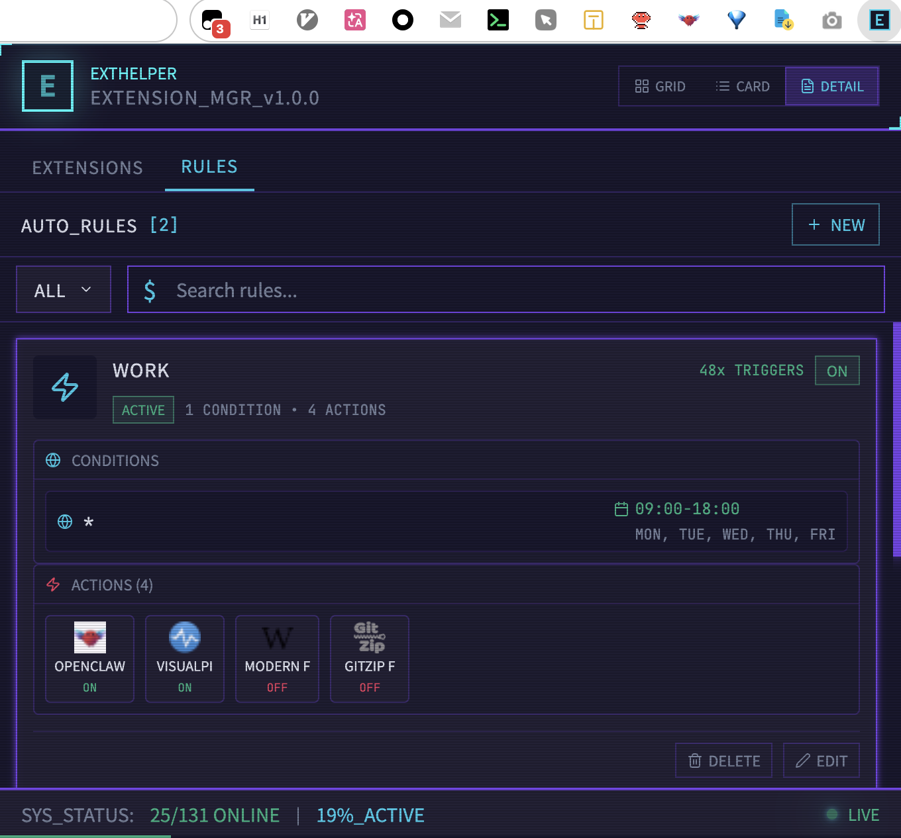

# Ext Helper



A browser extension manager for Chrome, Firefox, and Edge. Organize extensions into groups, automate enable/disable with rules, debug conflicts with binary-search bisect, discover site-relevant extensions with AI, and undo/redo changes instantly.

[Website](https://yeomanye.github.io/ext-helper/) · [Report an issue](https://github.com/YeomanYe/ext-helper/issues) · [Donate via PayPal](https://www.paypal.com/paypalme/yeomanye)

## Screenshots

| Card View                                                    | Bisect Debugger                                                      | Auto Rules                                                     |
| ------------------------------------------------------------ | -------------------------------------------------------------------- | -------------------------------------------------------------- |
|  |  |  |
| Color-coded groups, at-a-glance status                       | Binary search finds the culprit in log₂(n) steps                     | Domain + schedule conditions toggle extensions automatically   |

## Features

- **Enable / disable** any installed extension from a unified popup
- **Groups** — color-coded collections with drag-and-drop reorder and bulk toggle
- **Automation rules** — conditions on domain (exact / contains / wildcard / regex) and schedule (days + time range) that enable or disable extensions or whole groups
- **Bisect debugger** — binary-search through enabled extensions to isolate one that breaks a site, with a **whitelist** to protect critical extensions during testing
- **Site extension discovery** — AI-powered panel that surfaces installed extensions applicable to the current website, plus **cloud-suggested** recommendations for extensions you don't have yet
- **AI group suggestions** — let an LLM pick the right extensions for a group based on name, description, and permissions
- **Usage log** — timestamped history of every enable / disable / install / uninstall event with per-extension stats
- **Config & log import / export** — back up and restore groups, rules, preferences, and usage logs
- **Snapshot undo / redo** — every mutation is reversible
- **Theme toggle** — dark / light / system modes with a punk-themed design system
- **Find shortcut** — press <kbd>/</kbd> to jump to search anywhere in the popup
- **Cross-browser** — Chrome, Firefox, and Edge MV3 builds (built on Plasmo)

## Install

[**Install from the Chrome Web Store →**](https://chromewebstore.google.com/detail/ext-helper/bnoomkhaemojkbmdmniifkijjaiiomfl)

Edge Add-ons support is packaged from the same source. Firefox Add-ons are also available. You can also load from source — see [Development](#development).

## Development

Requires Node 20+ and pnpm 9+.

```bash
pnpm install

pnpm dev          # Alias for pnpm dev:chrome
pnpm dev:chrome   # Plasmo dev for Chrome MV3 — build/chrome-mv3-dev
pnpm dev:edge     # Plasmo dev for Edge MV3 — build/edge-mv3-dev
pnpm dev:chrome:package # One-shot Chrome MV3 dev package — build/chrome-mv3-dev
pnpm dev:edge:package   # One-shot Edge MV3 dev package — build/edge-mv3-dev
pnpm dev:extension # Plasmo dev watchers for Chrome MV3 + Edge MV3
pnpm dev:web      # Vite web preview with mock data on :4173
pnpm dev:website  # Marketing site (website/)
pnpm dev:all      # Chrome dev + Edge dev + web + website

pnpm build            # Chrome + Edge production builds
pnpm build:chrome     # Chrome MV3 production build
pnpm build:edge       # Edge MV3 production build
pnpm package          # Chrome + Edge zipped store packages
pnpm build:website    # Marketing site production build

pnpm test          # Vitest watch
pnpm test -- --run # Single run
pnpm lint          # ESLint
pnpm format        # Prettier
```

See [`CLAUDE.md`](CLAUDE.md) for a deeper tour of the architecture, and `docs/` for PRD, architecture, and module docs.

## Roadmap

See [`TODO.md`](TODO.md).

- [ ] Cloud sync — store groups, rules, and preferences in the cloud with multi-device sync
- [ ] Style pack switching — swap the punk aesthetic for other visual themes (minimal, skeuomorphic, cartoon)

## Support

If Ext Helper saves you time, a tip goes a long way toward keeping it maintained.

[**Donate via PayPal →**](https://www.paypal.com/paypalme/yeomanye)

## License

MIT
